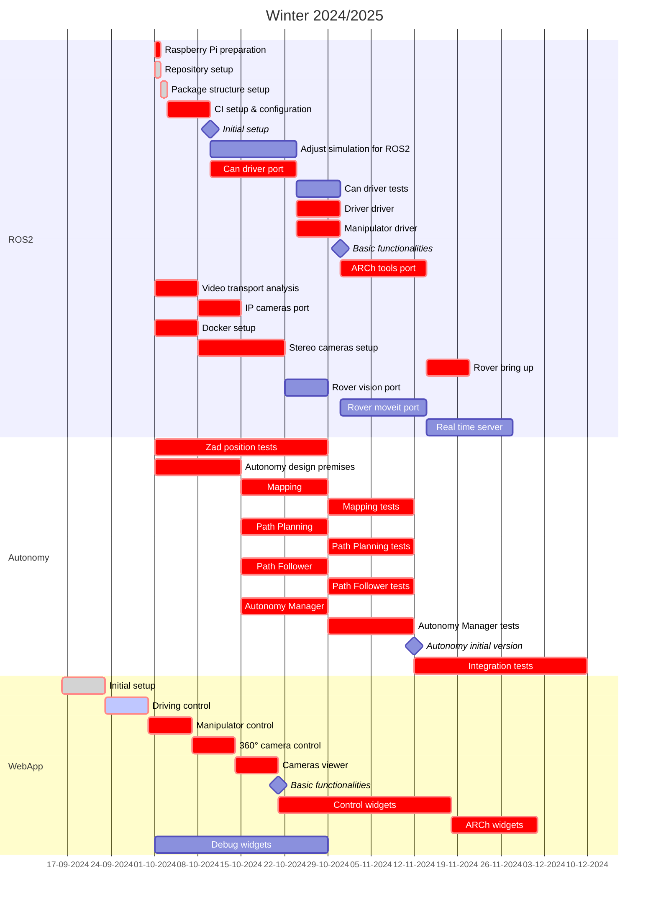

# Plan

```mermaid
gantt
title Winter 2024/2025
dateFormat  DD-MM-YYYY
axisFormat %d-%m-%Y
tickInterval 1week
weekday tuesday

section ROS2
    Raspberry Pi preparation    : crit, rpi_prep, 01-10-2024, 1d
    Repository setup            : crit, done, repo_setup, 01-10-2024, 1d
    Package structure setup     : crit, done, package_structure_setup, after repo_setup, 1d
    CI setup & configuration    : crit, ci_setup, after package_structure_setup, 1w
    Initial setup               : milestone,
    Adjust simulation for ROS2  : 2w
    Can driver port             : crit, can_driver, after ci_setup, 2w
    Can driver tests            : can_driver_test, after can_driver, 1w
    Driver driver               : crit, drive_driver, after can_driver, 1w
    Manipulator driver          : crit, mani_driver, after can_driver, 1w
    Basic functionalities       : milestone, basic_fn
    ARCh tools port             : crit, arch_tools, after drive_driver, 2w
    Video transport analysis    : crit, video_analysis, 01-10-2024, 1w
    IP cameras port             : crit, after video_analysis, 1w
    Docker setup                : crit, docker, 01-10-2024, 1w
    Stereo cameras setup        : crit, stereo_cameras, after docker, 2w
    Rover bring up              : crit, after stereo_cameras arch_tools, 1w
    Rover vision port           : after stereo_cameras, 1w
    Rover moveit port           : after mani_driver, 2w
    Real time server            : 2w

section Autonomy
    Zad position tests          : crit, zed_position_tests, 01-10-2024, 4w
    Autonomy design premises    : crit, autonomy_design_premises, 01-10-2024, 2w
    Mapping                     : crit, mapping, after autonomy_design_premises, 2w
    Mapping tests               : crit, mapping_tests, after mapping, 2w
    Path Planning               : crit, path_planning, after autonomy_design_premises, 2w
    Path Planning tests         : crit, path_planning_tests, after path_planning, 2w
    Path Follower               : crit, path_follower, after autonomy_design_premises, 2w
    Path Follower tests         : crit, path_follower_tests, after path_follower, 2w
    Autonomy Manager            : crit, autonomy_manager, after autonomy_design_premises, 2w
    Autonomy Manager tests      : crit, autonomy_manager_tests, after autonomy_manager, 2w
    Autonomy initial version    : milestone,
    Integration tests           : crit, autonomy_integration_tests, after mapping_tests path_planning_tests path_follower_tests autonomy_manager_tests stereo_cameras drive_driver, 4w

section WebApp
    Initial setup               : crit, done, web_app_initial_setup, 16-09-2024, 1w
    Driving control             : crit, active, 1w
    Manipulator control         : crit, 1w
    360° camera control         : crit, 1w
    Cameras viewer              : crit, 1w
    Basic functionalities       : milestone,
    Control widgets             : crit, 4w
    ARCh widgets                : crit, 2w
    Debug widgets               : 01-10-2024, 4w
    
```
